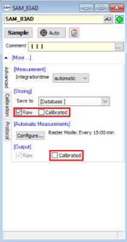
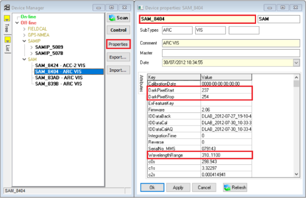
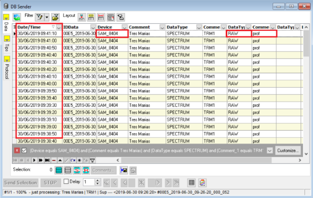
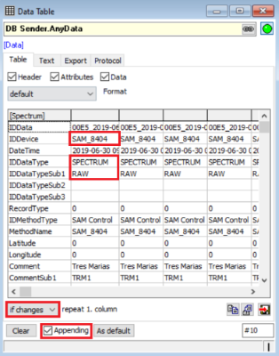
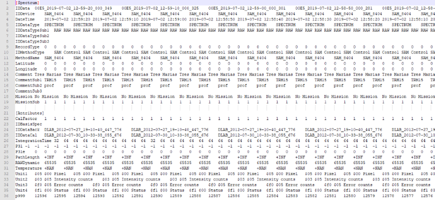

# *Ramses TriOS* Calibration - README

## 1) Resume

This is a [*Ramses TriOS*](https://www.trios.de/en/ramses.html "TriOS Website") sensor data calibration script (`trios_calibration`) based on its
[Manual Release 1.1](./doc/RAMSES_manual_v_1_1.pdf "Ramses TriOS Manual Release 1.1 (Principle of Operation)")

The principle of `trios_calibration` is for those who have to deal with failures in the use and measurements taken using Ramses TriOS sensors.The `trios_calibration` uses the output
raw data extracted from `MSDA_xe` software in `".txt"` extension, and calibrate it.

In case of malfunction of *TriOS* devices during field measurements or in case of user unmark calibrated data checkbox on `MSDA_xe` during measurements (**Figure 1**).

**Figure 1 - Device box on `MSDA_xe` software.**



**Box marked in red is showing the calibration checkbox.**

The formula to calibrate *Ramses TriOS* raw data uses a offset and background removal followed by a normalization by time of integration and calibration coefficient (**Equation 1**).

				(**Eq. 1**)

Where:  is the normalized raw digital number (DN) data measured by *TriOS*;
 is the *backgroud* of *TriOS* sensor;
 is the *offset* based on equipments dark current spectral range;
 is a integration time normalization factor;
 the sensistivy function of the equipment;
and,  the normalized wavelength index number (row) for 8 bits.
The `WavelengthRange` of the equipment comprehends the spectrum from 310 to 1100 nanometers (Figure 2) quantized in 8 bits
().

 is calculated using `MSDA_xe` raw data `SAM_xxxx_RAW.txt` converting it from 16 bit DN data to floting point
normalized data () (**Equation 2**).

				(**Eq. 2**)

Where  is the 16 bit DN raw data and `65535` is iqual to 16 bit (maximum signal).

 is calculated based on `MSDA_xe` *background* data `Back_SAM_xxxx.dat`, each equipment has its own
*background* data containing one or two columns in it. If your *TriOS* `Back_SAM_xxxx.dat` has just one column 
parameter will be equal it. Or, if your `Back_SAM_xxxx.dat` has two columns  will be equal the column 0 plus
column 1 normalized by the integration time of the measurement (**Equation 3**).

				(**Eq. 3**)

Where  is the column 0,  the column 1.
 is expressed as the ratio scale between the maximum integration time of `8192 ms`
() and the integration time of the present measurement
(), as shown bellow (**Equation 4**):

				(**Eq. 4**)

The term of *background* removal  is represented as
. The *offset*  values are calculated as the
mean average of  for  between
 and , device properties representing the
dark current at the end of the espectral range of measurement. The mean average of  for
 between  and
 are known as `DarkPixelStart` and `DarkPixelStop` parameters of *TriOS* devices (**Figure 2**). Usually,
`DarkPixelStart` and `DarkPixelStop` values are the same for all *TriOS* devices, but you can assess it using `MSDA_xe`. 

**Figure 2 - Device manager box on `MSDA_xe` software.**



**Boxes marked in red are showing the device `SAM_8404` properties.**

The term of *offset*  is represented as .
The term of time integration normalization  is respresented as
.

At last, the term of sensitivity calibration  is represented as
 the final `Calibrated Data`.  is calculated
based on `MSDA_xe` *sensitivity* data `Cal_SAM_xxxx.dat`.

## 2) Installation - Requirements

Just copy the entire `trios_calibration` folder to your `Windows` system. 

As requirement the user have to use a environment with pandas installed in it. This can be done using the following command:
```
pip install pandas
```

or in the anaconda prompt:

```
conda install pandas
```

## 3) Input Configurations

The inputs of `trios_calibration` are the raw data `SAM_xxxx_RAW.txt` from `MSDA_xe`, the `Back_SAM_xxxx.dat` and `Cal_SAM_xxxx.dat`. In order to use *background* and *sensitivity*
data from `MSDA_xe` the user has to convert it to `.txt` and rename it as `SAM_xxxx_BACK.txt` and `SAM_xxxx_CAL.txt` respectively.

In order to export `SAM_xxxx_RAW.txt` from `MSDA_xe` (**Figure 3**) the user has to sort `Date/Time` descending as a default measurements from bottom to top in water column.

**Figure 3 - `MSDA_xe` Data Sender selection.**



**Boxes marked in red are showing the device `SAM_8404` properties as `RAW` and sorting `Date/Time` descending.**

The user has to remember of checking `Appending` box and setting repetition escheme to `if changes` (**Figure 4**), so the output raw `.txt` data will be a Data Frame with one index
column and the data itself.

**Figure 4 - `MSDA_xe` Data Table Exportation.**



**Boxes marked in red shows `SAM_8404` properties as `RAW` the column repetition escheme as `if changes` and marked `Appending` checkbox.**

This script uses the raw `.txt` data exported from `MSDA_xe` (**Figure 5**) with `\t` separation.

**Figure 5 - `MSDA_xe SAM_xxxx_RAW.txt` output data used as input of `trios_calibration.**



**Format of the `.txt` output data from `MSDA_xe.**

`Back_SAM_xxxx.dat` and `Cal_SAM_xxxx.dat` changes for each *Ramses TriOS* sensor and every time the equipment is calibrated in laboratory bench. These data are provided by the
manufacturer after each calibration process, so keep in mind to handle carefully with these data, always saves a backup of them.

`SAM_xxxx_RAW.txt`, `SAM_xxxx_BACK.txt` and `SAM_xxxx_CAL.txt` data for each *TriOS* sensor has to be put inside a new campaign foldel inside `.trios_calibration\input` directory.
As the same, the user has to create a new campaign folder inside the `.\trios_calibration\output` directory.

## 4) Code description

To follow this code description open `trios_calibration` ([trios_calibration.py](./trios_calibration.py "trios_calibration code")) on the algoritm root directory. The packages needed for the data processing are: 

```python
##  Packages importation:
import os
import glob
import pandas as pd
import statistics as st
import unicodedata as ud
```

`trios_calibration` is a algoritm that needs five (5) variable inputs, its definition is shown bellow:

```python
def trios_calibration(campaign, above_water, under_water, n1, n2): 
    '''
    ----------
    Parameters
    ----------
    campaign : String
        Campaign folder name inside input directory.
        
    above_water : List of Strings
        List with tags for measurements gathered above water surface.
        Ex.: ['Sup', 'sup', 'surface']
        
    under_water : List of Strings
        List with tags for measurements gathered above water surface.
        Ex.: ['Sub', 'sub', 'Prof', 'prof', 'Perf', 'perf']
		
	n1: Integer
		`'DarkPixelStart' for TriOS devices, related to the dark current in the end of spectrum.
	
	n2: Integer
		'DarkPixelStop' for TriOS devices, related to the dark current in the end of spectrum.

    -------
    Returns
    -------
    calibrated_data: DataFrame
        ".txt" and ".csv" calibrated data saved on campaign folder inside
        output directory.
    ''' 
```

### 4.1) Folders preparation

First, `trios_calibration` mounts the strings containing the util folder and `campaign` input and output folders:

```python
    ##  ['input'] directory call:
    dir_i = os.path.join(os.getcwd(), r'input\\' + campaign)
    ##  ['output'] directory call:
    dir_o = os.path.join(os.getcwd(), r'output\\' + campaign)
    ##  ['util'] directory call:
    dir_u = os.path.join(os.getcwd(), r'util')
```

Then, the algoritm enters `campaign` input folder and lists all raw `.txt` files inside it:

```python
    ##  Getting inside input ['campaign'] folder:
    os.chdir(dir_i)
    
    sensor_list = glob.glob('*_RAW.txt')
```

### 4.2) `sensor_list` iteration

After creating the raw data list for all sensors the code iterates all the processing for each sensor `.txt` data:

```python
    for i in sensor_list:
```

From now on, all code will be nested under the code above.

### 4.3) Environment of measurements for the sensor

Before processing sensor's raw data the algoritm asks the user if the round sensor was used for under water measurements. The user has to answer ´Yes/No´ or one of its forms
('yes', 'Y', 'y', 'no', 'N', 'n').

```python
        ##  Input for which environments were measured by the sensor, one may have in
        ##  mind how the sensor was used in the campaign, usually the sensors "SAM_8404",
        ##  "SAM_xxxx" and "SAM_xxxx" are used just for above-water measurements, while
        ##  "SAM_xxxx", "SAM_xxxx" and "SAM_xxxx" are used for measurements taken above
        ##  and underwater, but other configurations can be used:
        amb = str(input('Underwater measurements were taken with the sensor: ' + sensor + '? [Yes/No]'))
        ##  Nomalization of the answer (string):
        amb = ud.normalize('NFD', amb)
        amb = amb.encode('ascii', 'ignore')
        amb = amb.decode('utf-8')
        amb = amb.lower()
```

If the user gives a wrong answer the algoritm will ask him to answer it again:

```python   
        ##  In case of wrong answer the script ask it again:
        while amb not in ['yes', 'no', 'y', 'n']:
            print('[PLEASE ANSWER IT AGAIN!!]')
            amb = str(input('Underwater measurements were taken with the sensor: ' + sensor + '? [Yes/No]'))
            ##  Nomalization of the answer (string):
            amb = ud.normalize('NFD', amb)
            amb = amb.encode('ascii', 'ignore')
            amb = amb.decode('utf-8')
            amb = amb.lower()
```

### 4.4) Data preparation

To preparate the data the algoritm extracts the sensor's name from the `*_RAW.txt` data in the round:

```python
        sensor = i.replace('_RAW.txt', '')
```

From `sensor` var the algoritm creates strings to call raw, *background* and *sensitivity* input data, ancillary data and to save the outputs:

```python
        ##  From sensors name the script mounts the variables to call each ".txt" archive;
        ##  Input data has to be name in uppercase inside the directory:
        back = sensor + '_BACK.txt'
        cal = sensor + '_CAL.txt'
        raw = sensor + '_RAW.txt'
        ##  Output ".csv" data name:
        data_csv = sensor + '.csv'
        ##  Output ".txt" data name:
        data_txt = sensor + '.txt'
        ##  Ancillary data frame with index column to normalize output data. It must
        ##  be inside ['util'] directory found on the root of the application:
        mcol = 'mcol.txt' 
```

With the strings created above the algoritm opens raw and mcol Data Frames using `Pandas`:

```python
        ##  Using Pandas to open Data Frames used in the final arrange of the product:
        df_calibrated = pd.read_csv(raw,
                                    delimiter = '\t',
                                    na_values = '',
                                    engine = 'python')
        
        os.chdir(dir_u)
        
        df_mcol = pd.read_csv(mcol,
                              delimiter = '\t',
                              na_values = '',
                              engine = 'python')
        
        os.chdir(dir_i)
```

Then, the algoritm uses raw and mcol Data Frames to stablish a set of indexes that will be used by the algoritm to mount the product Data Frame:

```python
        ##  Indexes used to operate over Data Frames during the routine;
        ##  Index for wavelength column data:
        i_mcol = df_mcol.loc[df_mcol['[Spectrum]'] == '[Data]'].index[0] + 1
        ##  Index for the integration time of the measurements:
        i_time = df_calibrated.loc[df_calibrated['[Spectrum]'] == 'IntegrationTime'].index[0]
        ##  Index to call the data inside Data Frame:
        i_data = df_calibrated.loc[df_calibrated['[Spectrum]'] == '[Data]'].index[0] + 1
        ##  Index for +NAN data in the claibrated product:
        i_data2 = df_calibrated.loc[df_calibrated['[Spectrum]'] == '[Data]'].index[0] + 5
        ##  Index to call end of Data Frame to compose data:
        i_data3 = df_calibrated.loc[df_calibrated['[Spectrum]'] == '[Data]'].index[0] + 196
        ##  Index for +NAN data at the end of calibrated Data Frame product:
        i_data4 = df_calibrated.loc[df_calibrated['[Spectrum]'] == '[END] of [Data]'].index[0]
        ##  Index for CommentSub2 line ['under_water', 'above_water'] for each measurement:
        i_cal = df_calibrated.loc[df_calibrated['[Spectrum]'] == 'CommentSub2'].index[0]
        ##  Index with location of the data status ['Raw', 'Calibrated']:
        i_type = df_calibrated.loc[df_calibrated['[Spectrum]'] == 'IDDataTypeSub1'].index[0]
        ##  Series based on indexes inside data range in the Data Frame:
        i_range = pd.Series(range(i_data2, i_data3))
```

The calibrated Data Frame is then organized to receive the processed data and final `.txt` and `.csv` saveing:

```python
        ##  Column with wavelength in nanometers and insertion in the final data:
        df_mcol = df_mcol.iloc[i_mcol:, 0]
        ##  Output Data Frame ready to receive calibrated data after process:
        df_calibrated.iloc[i_data:, 0] = df_mcol
```

At least, the algoritm opens all input raw, cal and back datas using the indexes to extract only the spectral data:

```python
        ##  Opening Data Frames only with the data to be operated using indexes:
        data_back = pd.read_csv(back,               ##  Name of the Data Frame;
                                delimiter = '\t',   ##  Delimitation with TAB;
                                na_values = '',     ##  NaN values using '';
                                engine = 'python',  ##  Pandas engine;
                                skiprows = i_data,  ##  Rows to skip using index;
                                skipfooter = 2)     ##  Rows to skip from bottom to head;
        
        data_cal = pd.read_csv(cal,
                               delimiter = '\t',
                               na_values = '',
                               engine = 'python',
                               skiprows = i_data2,
                               skipfooter = 62)
        
        data_raw = pd.read_csv(raw,
                               delimiter = '\t',
                               na_values = '',
                               engine = 'python',
                               skiprows = i_data,
                               skipfooter = 2)
```

### 4.5) Parameters preset

Preset of calculation parametes used in the calibration. The calibration consists in a offset and background removal, followed by a normalization by integration time and calibration
coefficient of the sensor.

First the algoritm creates :

```python
        t0 = 8192                       ##  Maximum integration time in [ms];
```

Then, the algoritm creates the  16 bi var ():

```python
        b16 = (2 ** 16) - 1             ##  16 bits counting for normalization;
```

At least, separates the two columns from the *sensitivity* data in ´AIR´ and ´AQUA´ calibration data: 

```python
        S_air = data_cal.iloc[:, 1]     ##  "AIR" constant of calibration;
        S_aqua =  data_cal.iloc[:, 2]   ##  "AQUA" constant of calibration;
```

### 4.6) Data processing (calibration)

First the algoritm creates  by normalizing the raw DN data: 

```python
        ##  Nomalization of digital numbers (DN) with 16 bits:
        M = data_raw.iloc[:, 1:] / b16
```

Following it the algoritm counts the number of measurements (columns) in the Data Frame:

```python
        ##  Measurements counting variable (number of columns in Data Frame):
        M_count = M.iloc[0, :].count() - 1
```

Then, it creates empty Data Frames for each step of the original process from the
[Manual Release 1.1](./doc/RAMSES_manual_v_1_1.pdf "Ramses TriOS Manual Release 1.1 (Principle of Operation)"):

```python
        ##  Empty Data Frame to start the process with Background removal:
        C = pd.DataFrame()
        ##  Empty Data Frame to start the process with Offset removal:
        D = pd.DataFrame()
		##  Empty Data Frame for K normalization;
        E = pd.DataFrame()
```

 step is processed by the following code:

```python
        ##  Background removal and insartion of new data into "C" Data Frame:
        x = 0
        while x <= M_count:
            i = 'Unnamed: ' + str(x + 1)
            t = int(df_calibrated.iloc[i_time, x + 1])                    ##  Measurements integration time;
            coef_t = t / t0                                               ##  "B" coefficient;
            B = data_back.iloc[0:, 1] + (data_back.iloc[0:, 2] * coef_t)  ##  Background to remove;
            C[i] = M.iloc[:, x] - B
            x += 1
```

Then,  processing removing the *offset*:

```python
        ##  Offset and insertion of new data into "D" Data Frame:
        y = 0
        while y <= M_count:
            j = 'Unnamed: ' + str(y + 1)
            D[j] = C.iloc[:, y] - st.mean(C.iloc[n1:n2, y])
            y += 1
```

Followed by  normalization in the  step:

```python
        ##  K normalziation and insertion of new data tion "E" Data Frame:
        z = 0
        while z <= M_count:
            q = 'Unnamed: ' + str(z + 1)
            t = int(df_calibrated.iloc[i_time, z + 1])      ##  Measurements integration time;
            k = t0 / t                                      ##  K coefficient;
            E[q] = D.iloc[:, z] * k
            z += 1
```

In order to proceed to the final step the algoritm copy  var and organizes it for the following process:

```python
        F = E.iloc[4:195].copy()    ##  Copy of "E" for division by "S_air" or "S_aqua";
        F = F.reset_index()         ##  Index reset;
        del F['index']              ##  Deleting column create by the code;
```

Then, the algoritm uses the environment answer from the beggining of the process to set `S_air` and `S_aqua` data:

```python
        ##  Calibrating data due to choosed environment "Air" or "Aqua":
        if amb in ['n']:
            S_aqua = S_air.copy()
```

At least, the algoritm calibrates the data using the *sensitivity* function of the sensor:

```python		
        u = 0
        while u <= M_count:
            if df_calibrated.iloc[i_cal, u + 1] in above_water:
                F.iloc[:, u] = F.iloc[:, u] / S_air
            elif df_calibrated.iloc[i_cal, u + 1] in under_water:
                F.iloc[:, u] = F.iloc[:, u] / S_aqua
            u += 1
```

As a final cosmetic process a new index is set:

```python
        ##  Index seting to "F" Data Frame:
        F = F.set_index(i_range)
```

The final product is created by copying the processe data  for the calibrated Data Frame. The also corrects +NAN 
bands and changes the data status:

```python
        ##  Copying calibrated data into final Data Frame:
        df_calibrated.iloc[i_data2:i_data3, 1:] = F
        ##  Invalid data wavelengths:
        df_calibrated.iloc[i_data:i_data2, 1:] = '+NAN'
        df_calibrated.iloc[i_data3:i_data4, 1:] = '+NAN'
        ##  Changing the data status:
        df_calibrated.iloc[i_type, 1:] = 'CALIBRATED'
```

### 4.7) Saving calibrated data

In order to save the processed data in the output folder the algotirmhas to enter it:

```python
        ##  Getting inside output ['campaign'] folder:
        os.chdir(dir_o)
```

The last command of the algoritm is to save the `.txt` and `.csv` output data:

```python
        ##  Saving final Data Frame into ".csv" and ".txt" archives on output directory:
        df_calibrated.to_csv(data_txt, sep = '\t', encoding = 'utf-8', index = False)
        df_calibrated.to_csv(data_csv, encoding = 'utf-8', index = False)
        ##  The results are identical to the default calibrated data released by TriOS
        ##  using MSDA_xe software;
```

This process is repeated for each raw sensor's data in the input folder of the campaign.

## 5) Using `trios_calibration` package

With campaing data organized in respective input `.\trios_calibration\input\new_campaign` folder, one user can use his favorite `code editor` or use `IPython` to process the data.
First, the user has to set `.\trios_calibration` folder as work directory, which can be achieved using the following code:

```python
import os

os.chdir(r'.\...\trios_calibration')
```

Always remember to copy `trios_calibration` application in a folder without the `"01_"`before its name, this is just an artifice to organize the portfolio folders.

Then, import `trios_calibration` package to use it, using the code bellow:

```python
from trios_calibration import trios_calibration
```

or

```python
from trios_calibration import *
```

As an example of use, the processing of `.\trios_calibration\input\example` campaign is shown bellow.

Campaign name:

```python
campaign = 'example'
```

Above water tag names used for `CommentSub2` in raw data:

```python
above_water = ['Sup', 'sup', 'Sup2', 'sup2']
```

Under water tag names used for `CommentSub2` in raw data:

```python
under_water = ['Sub', 'sub', 'Sub2', 'sub2', 'Prof', 'prof', 'Perf', 'perf']
```

`above_water` and `under_water` tags are chosen based on descripton made durin field measurements.

`DarkPixelStart` value for the sensors:

```python
n1 = 237 - 1
```

`DarkPixelStop` value for the sensors:

```python
n2 = 254
```

Application of `trios_calibration` function:

```python
trios_calibration(campaign, above_water, under_water, n1, n2)
```

Now the user can find the output product inside `.\trios_calibration\output\example` directory named as `SAM_8404.txt` and `SAM_8404.csv` formats.
